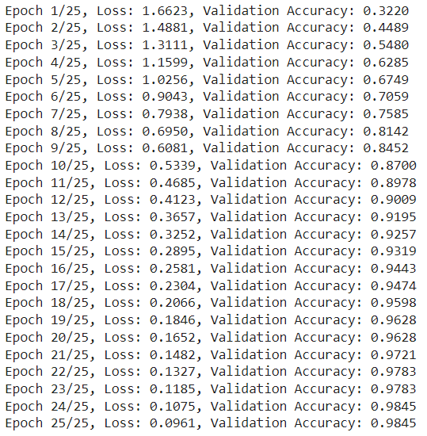
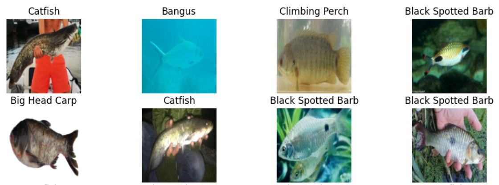

# FishiFy: Fish Species Classification

## Project Overview

FishiFy is a machine learning project designed to classify fish species using images. Leveraging the ResNet-18 architecture, a deep Convolutional Neural Network (CNN), this project focuses on identifying fish species from a dataset that contains various fish species.

## Model

The model used in this project is ResNet-18, a well-known Convolutional Neural Network (CNN) that includes 18 layers. ResNet-18 is effective for image classification tasks due to its residual block design, which helps in training deeper networks by mitigating the vanishing gradient problem. The network was initialized with pre-trained weights from ImageNet and fine-tuned for the specific task of fish species classification.

## Dataset

The dataset used for this project is sourced from [Kaggle's Fish Dataset](https://www.kaggle.com/datasets/markdaniellampa/fish-dataset). While the dataset includes multiple fish species, only 5 categories were selected for the training and evaluation of the model.

## Training and Results

- **Training Environment**: The model was trained using PyTorch on Google Colab with GPU support.
- **Validation Accuracy**: 98.45%
- **Test Accuracy**: 96.65%

The high accuracy rates demonstrate the effectiveness of using ResNet-18 for classifying fish species, even with only 5 categories out of a more extensive dataset.

## Training Visualization

### Training Loss and Validation Accuracy

This image shows the training loss and validation accuracy over epochs, illustrating the model's performance improvement throughout the training process.

### Sample Dataset Images

This image provides examples of the dataset used in the project, showcasing some of the fish species included in the training and evaluation phases.